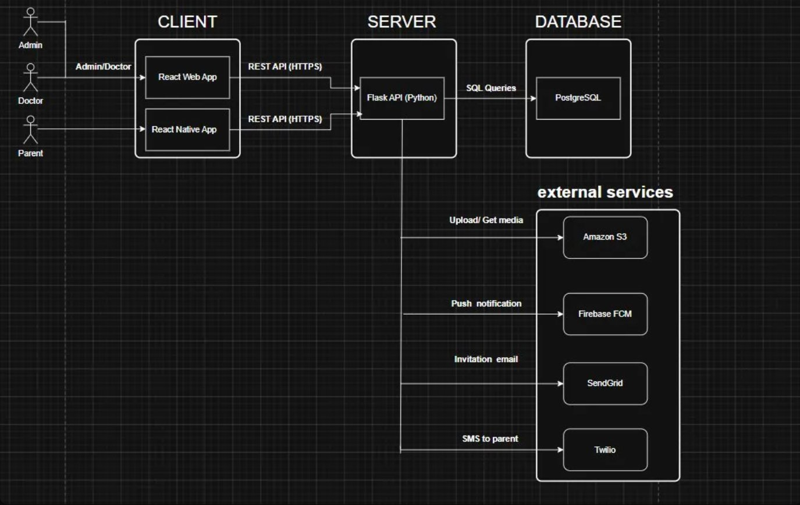
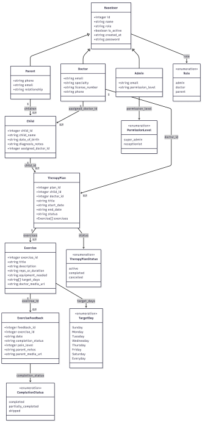
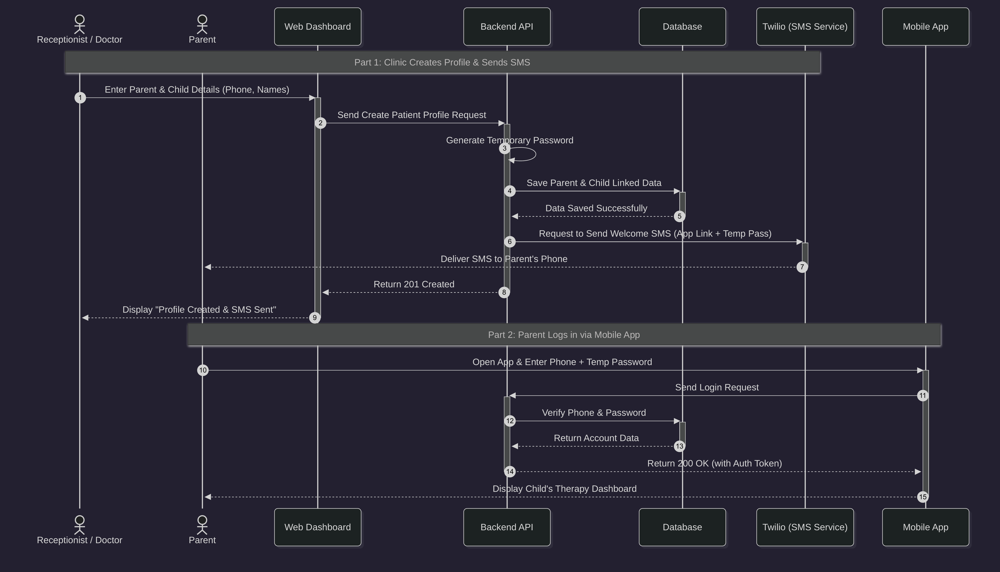
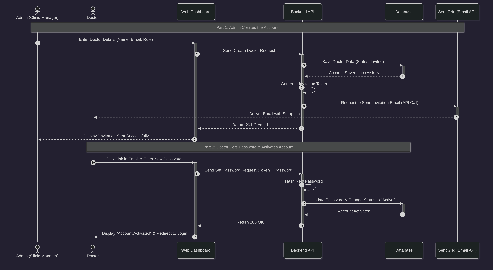
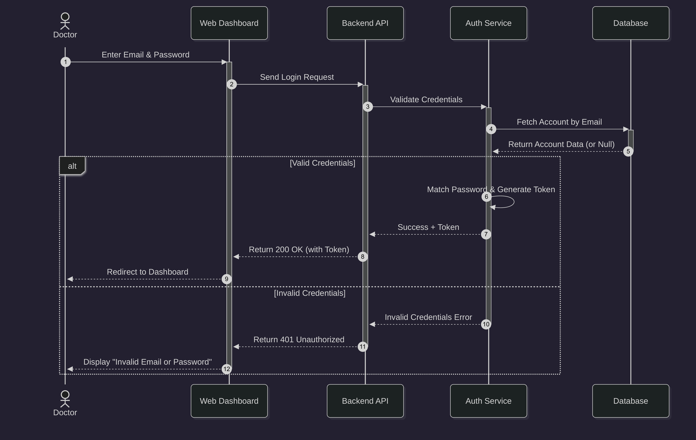
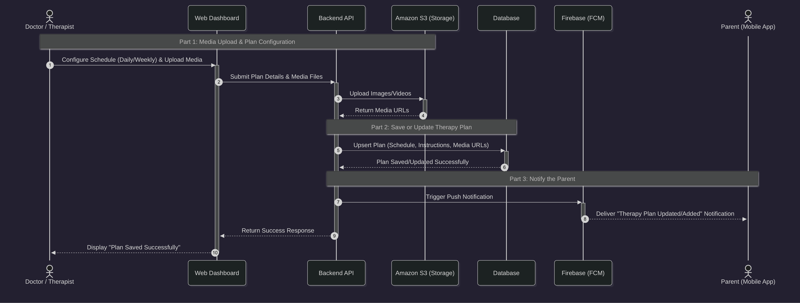
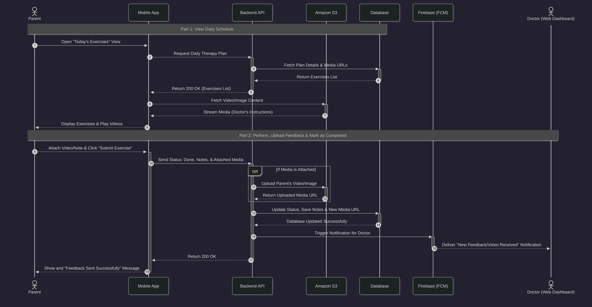

# Mutabi Platform — Technical Design Document

---

## Table of Contents

1. [User Stories and Mockups](#1-user-stories-and-mockups)
2. [System Architecture](#2-system-architecture)
3. [Components, Classes, and Database Design](#3-components-classes-and-database-design)
4. [Sequence Diagrams](#4-sequence-diagrams)
5. [API Specifications](#5-api-specifications)
6. [SCM and QA Plans](#6-scm-and-qa-plans)
7. [Technical Justifications](#7-technical-justifications)

---

## 1. User Stories and Mockups

### 1.1 User Types

- **Parent** — Mobile App
- **Doctor** — Web Dashboard
- **Admin / Clinic Staff** — Web Dashboard

---

### 1.2 Prioritized User Stories (MoSCoW)

#### Must Have

| ID | User Story | Acceptance Criteria |
|---|---|---|
| US-01 | As a parent, I want to log in securely, so that I can access my child's exercises and progress. | Parent can log in using phone or email and password. Invalid credentials show a clear error message. Successful login redirects to the parent home screen. |
| US-02 | As a parent, I want to view daily assigned exercises, so that I can complete therapy activities on schedule. | Parent sees only exercises assigned to the selected child. Exercises are filtered by selected date. Exercise cards show title, instructions, and required repetitions/duration. |
| US-03 | As a parent, I want to submit exercise completion with notes and optional media, so that the doctor can review performance. | Parent can mark an exercise as completed, partially completed, or skipped. Parent can enter notes and pain/mood rating. Parent can upload image/video and submit successfully. |
| US-04 | As a doctor, I want to create and assign therapy plans, so that each child has a clear personalized program. | Doctor can select child and create a plan with start date and exercises. Plan supports target days per exercise. Saved plan appears in parent daily schedule. |
| US-05 | As a doctor, I want to review child progress logs, so that I can adjust therapy plans based on actual home performance. | Doctor can see session history by child and date range. Doctor can view status, notes, ratings, and media attachments. Doctor can update existing plan details. |
| US-06 | As clinic staff, I want to create parent and child profiles, so that new families can start using the platform quickly. | Staff can register parent and child in one flow. Child can be assigned to a doctor. Parent receives onboarding message with access details. |

#### Should Have

| ID | User Story | Acceptance Criteria |
|---|---|---|
| US-07 | As a doctor, I want to edit or deactivate exercises in the exercise library, so that I can keep content accurate and safe. | Doctor can update title/description/reps/media. Doctor can remove inactive templates from future use. |
| US-08 | As a parent, I want a monthly schedule view, so that I can plan therapy sessions in advance. | Parent can view exercises by date range. Completed and pending statuses are visible in the calendar. |
| US-09 | As a doctor, I want basic progress summaries, so that I can quickly identify adherence trends. | Dashboard shows completion rate per child. Dashboard highlights missed sessions. |

#### Could Have

| ID | User Story | Acceptance Criteria |
|---|---|---|
| US-10 | As a parent, I want in-app reminders, so that I do not forget daily exercises. | Parent can enable or disable reminder notifications. Reminder time can be configured. |
| US-11 | As a doctor, I want exportable reports, so that I can share progress snapshots with clinic teams. | Doctor can export a child summary report in PDF. |

#### Won't Have (MVP Scope)

| ID | User Story | Reason |
|---|---|---|
| US-12 | As a parent, I want live video consultation inside the app. | Out of MVP scope due to time and complexity constraints. |
| US-13 | As a user, I want integrated payment inside the platform. | Out of MVP scope and not required for core therapy tracking workflow. |

---

### 1.3 Mockups

> 🔗 **Figma Mockups:** [View Full Mockups on Figma](https://www.figma.com/design/eHsSbJF5GCIwHwPnOqOco6/mutabi?node-id=13-514&p=f&t=f038kBKUjWo6WQVA-0)

---

### 1.4 API Interaction Mapping

> 🔗 **Full API Documentation:** [View on Stoplight](https://mutabi.stoplight.io/docs/api-docs/jp7s4sprwyc4q-external-ap-is-integration)

---

## 2. System Architecture



---

## 3. Components, Classes, and Database Design

### 3.1 ER Diagram



> 🔗 **Interactive DB Diagram:** [View on drawDB](https://drawdb.vercel.app/editor/diagrams/22320986-58d5-4b3f-8469-66a31e9230f5)

---

### 3.2 Database Schema

```
BaseUser
  - integer  id (PK)
  - string   name
  - string   role            [admin | doctor | parent]
  - boolean  is_active
  - string   created_at
  - string   hashed_password

Parent (extends BaseUser)
  - string   phone
  - string   email
  - string   diagnosis_notes
  - string   relationship

Doctor (extends BaseUser)
  - string   email
  - string   specialty
  - string   license_number
  - string   phone

Admin (extends BaseUser)
  - string   admin_email
  - enum     permission_level  [super_admin | receptionist]

Child
  - integer  child_id (PK)
  - string   child_name
  - string   diagnosis
  - string   date_of_birth
  - integer  assigned_doctor_id (FK → Doctor)
  - integer  parent_id (FK → Parent)

TherapyPlan
  - integer  plan_id (PK)
  - integer  child_id (FK → Child)
  - integer  doctor_id (FK → Doctor)
  - string   title
  - string   diagnosis_notes
  - string   start_date
  - string   end_date
  - enum     status           [active | completed | cancelled]
  - list     exercises        (M2M → Exercise)

Exercise
  - integer  exercise_id (PK)
  - string   exercise_title
  - string   description
  - string   reps_or_duration
  - string   equipment_needed
  - integer  target_days
  - string   doctor_media_url

ExerciseFeedback
  - integer  feedback_id (PK)
  - integer  exercise_id (FK → Exercise)
  - string   date
  - enum     completion_status
  - integer  pain_level
  - string   parent_notes
  - string   parent_media_url

TargetDay (enum)
  Sunday | Monday | Tuesday | Wednesday | Thursday | Friday | Saturday | Everyday

CompletionStatus (enum)
  completed | partially_completed | skipped

PermissionLevel (enum)
  super_admin | receptionist
```

### 3.3 Key Relationships

| Relationship | Type | Description |
|---|---|---|
| Child ↔ Parent | Many-to-One | A child belongs to one parent |
| Child ↔ Doctor | Many-to-One | A child is assigned to one doctor |
| TherapyPlan ↔ Exercise | Many-to-Many | A plan contains multiple exercises; exercises can appear in multiple plans |
| TherapyPlan ↔ Child | Many-to-One | A child can have multiple therapy plans |
| ExerciseFeedback ↔ Exercise | Many-to-One | Feedback is submitted per exercise session |

---

## 4. Sequence Diagrams

### 4.1 Create Parent Account & First Login



---

### 4.2 Create Doctor Account & Activation



---

### 4.3 Doctor Login



---

### 4.4 Create Therapy Plan



---

### 4.5 Exercise Feedback Submission (Parent)



---

## 5. API Specifications

> 🔗 **Full API Documentation (Internal & External):** [View on Stoplight](https://mutabi.stoplight.io/docs/api-docs/jp7s4sprwyc4q-external-ap-is-integration)

---

## 6. SCM and QA Plans

### 6.1 Source Code Management (SCM)

**Version Control:** Git  
**Hosting Platform:** GitHub

#### Branching Strategy

| Branch | Purpose |
|---|---|
| `main` | Live production branch. Only fully tested and approved code. No direct commits allowed. |
| `development` | Integration branch. All reviewed work is merged here before promoting to `main`. |
| `architecture` | Project structure, configuration, and infrastructure changes. |
| `feature/[feature-name]` | One branch per feature or task (e.g., `feature/login`, `feature/therapy-plan`). |
| `doc` | All project documentation, technical specifications, and API references. |

#### Branch Flow

```
feature/login            ─┐
feature/therapy-plan     ─┤──► development ──► main
feature/exercise-feedback─┘         ▲
                                    │
architecture ──────────────────────►│
doc ───────────────────────────────►│
```

#### Commit Message Format

```
[type]: short description

Examples:
feat: add therapy plan creation endpoint
fix: resolve JWT token expiry issue
docs: update API endpoint documentation
refactor: clean up exercise feedback service
```

#### Pull Request Process

1. Developer finishes work on their branch.
2. Developer opens a Pull Request on GitHub targeting `development`.
3. At least one other team member reviews the code.
4. Reviewer checks for correctness, clarity, and consistency.
5. After approval, branch is merged into `development`.
6. After sufficient testing, a final PR is opened to merge into `main`.

> **Golden Rule:** Never commit directly to `main` or `development`. All changes must go through a Pull Request.

---

### 6.2 Quality Assurance (QA)

#### Testing Pyramid

```
        /\
       /E2E\          ← Full user journey testing
      /------\
     / Integr \       ← API and service connection testing
    /----------\
   /    Unit    \     ← Individual function testing
  /--------------\
```

#### Level 1 — Unit Testing

**Purpose:** Verify individual functions and components work correctly in isolation.

| Tool | Target |
|---|---|
| Pytest | Flask (Python) back-end |
| Jest | React web dashboard and React Native mobile app |

#### Level 2 — Integration Testing

**Purpose:** Verify that connected components communicate correctly.

| Tool | Target |
|---|---|
| Postman | Manual API endpoint testing |
| Pytest | Automated Flask + PostgreSQL integration tests |

#### Level 3 — End-to-End (E2E) Testing

**Purpose:** Validate complete user journeys across the entire system.

| Tool | Target |
|---|---|
| Cypress | React web dashboard (Doctor and Admin flows) |
| Appium | React Native mobile app (Parent flows) |

**Critical Journeys:**

**Journey 1 — Doctor Account Creation and Activation**
Admin creates doctor account → SendGrid sends invitation email → Doctor clicks link → Doctor sets password → Doctor logs in successfully → Doctor reaches dashboard.

**Journey 2 — Therapy Plan Creation and Parent Notification**
Doctor selects child → Doctor configures plan with exercises → Media uploaded to Amazon S3 → Plan saved to PostgreSQL → Firebase FCM sends push notification → Parent opens mobile app → Parent sees the new exercises.

**Journey 3 — Exercise Feedback Submission**
Parent opens daily schedule → Parent completes exercise → Parent uploads video to Amazon S3 → Parent submits feedback with notes and pain level → Doctor receives notification → Doctor views updated progress log.

#### Testing Tools Summary

| Test Level | Tool | Target | Run By |
|---|---|---|---|
| Unit | Pytest | Flask back-end | Developer |
| Unit | Jest | React web + React Native | Developer |
| Integration | Postman | All API endpoints | Developer |
| Integration | Pytest | Flask + PostgreSQL | Developer |
| E2E | Cypress | React web dashboard | QA / Developer |
| E2E | Appium | React Native mobile app | QA / Developer |

#### Deployment Pipeline

| Environment | Branch | Purpose |
|---|---|---|
| Staging | `development` | Internal testing before production. Runs all integration and E2E tests. |
| Production | `main` | Live environment for real doctors, admins, and parents. |

```
Developer pushes to feature branch
        ↓
Pull Request opened → Code Review → Approved
        ↓
Merged into development (Staging environment)
        ↓
Unit + Integration + E2E Tests run on staging
        ↓
All tests pass → Pull Request to main
        ↓
Final review and approval
        ↓
Merged into main (Production environment)
        ↓
Live for real users ✅
```

---

## 7. Technical Justifications

### 7.1 Architecture — Multi-Tenant SaaS

The system was designed as a cloud-based SaaS platform rather than a single-clinic custom application. Market research revealed a clear technical gap in the occupational therapy sector, where many clinics lack digital solutions to track home therapy plans. Building as a multi-tenant SaaS not only solves the problem for a single entity but provides a scalable solution for the entire sector, significantly increasing the project's business value.

### 7.2 Backend — Flask (Python)

Flask was selected to build the RESTful API for two strategic reasons. First, its micro-framework nature provides flexibility to build endpoints without unnecessary overhead. Second, all team members have previous experience and successful projects using Flask, allowing the team to allocate time and effort toward learning new technologies in other parts of the project rather than a new backend framework from scratch.

### 7.3 Database — PostgreSQL (Relational SQL)

A relational database was chosen over NoSQL due to the highly interconnected nature of medical data. The system relies heavily on complex relationships — linking a child to a parent and a doctor, and Many-to-Many relationships between therapy plans and the exercise library. SQL ensures data integrity and prevents redundancy. The team's extensive prior experience in designing relational databases further mitigates technical risk during development.

### 7.4 Mobile App — React Native

React Native was chosen to develop the parents' mobile app for two reasons. First, it enables building an application that runs on both iOS and Android from a single codebase, eliminating the need to write separate code in Swift or Kotlin. Second, the team's existing proficiency in JavaScript and the strategic choice to use React for web interfaces created a natural knowledge transfer between web and mobile development, reducing the learning curve and supporting timely delivery.

### 7.5 Web Frontend — React JS

The web dashboards for administration and doctors were built using React JS due to two main engineering advantages. First, its Component-Based Architecture allows building independent, reusable components across multiple interfaces (admin vs. doctor), adhering to the DRY (Don't Repeat Yourself) principle and simplifying maintenance. Second, React's Virtual DOM ensures exceptional page responsiveness, delivering a seamless Single Page Application (SPA) experience suitable for modern healthcare systems.

### 7.6 Cloud Storage — Amazon S3

Amazon S3 was adopted as a centralized storage solution for the platform's media files (clinic logos, exercise instructional images, feedback videos). This decision was based on two factors. First, reliability and industry standards — AWS is a leader in cloud storage, ensuring high availability, security, and fast file retrieval. Second, cost-efficiency — the Free Tier provides ample storage and data transfer allowances for the development and MVP launch phases, allowing the team to build and test without incurring early operational costs.

---

*End of Document*
